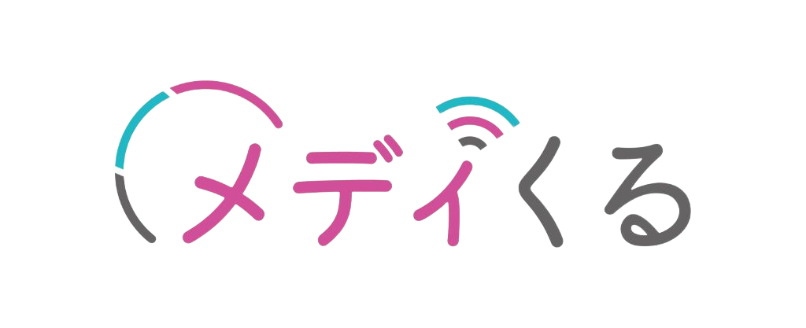

# メディくる — Codex ガイドライン

## プロジェクト概要

- **サービス:** 株式会社メディくる — AI検索時代対応型 指名検索ブランディング
- **URL:** https://medikuru.com/
- **技術スタック:** 静的HTML + Tailwind CSS (CDN) + AOS + FontAwesome
- **ホスティング:** GitHub Pages（リポジトリ: Kanta02cer/medikuru）
- **代表:** 漆沢 祐樹 / 問合せ: lp@medikuru.com

---

## サイト構成

```
index.html    ← TOP（AI検索時代対応型 指名検索ブランディング / 2サービス選択）
rjnqmw.html  ← 企業・商品ブランディングページ
kx15h2.html  ← 採用ブランディングページ
ダウンロード.png ← 公式ロゴ（全ページ共通）
CNAME        ← medikuru.com
```

---

## 共通実装ルール（必須）

### CDN（ローカルassets禁止）
```html
<!-- Tailwind CSS -->
<script src="https://cdn.tailwindcss.com"></script>
<!-- FontAwesome -->
<link rel="stylesheet" href="https://cdnjs.cloudflare.com/ajax/libs/font-awesome/6.5.2/css/all.min.css">
<!-- AOS -->
<link rel="stylesheet" href="https://unpkg.com/aos@2.3.1/dist/aos.css">
<script src="https://unpkg.com/aos@2.3.1/dist/aos.js"></script>
<!-- Google Fonts -->
<link href="https://fonts.googleapis.com/css2?family=Noto+Sans+JP:wght@400;500;700;800;900&display=swap" rel="stylesheet">
```

### GTM（全ページ head + body noscript 両方必須）
```html
<!-- GTM-WLJLFGBG -->
```

### ロゴ
```html

```

### ファビコン
```html
<link rel="icon" href="ダウンロード.png" type="image/png">
<link rel="apple-touch-icon" href="ダウンロード.png">
```

### LINE LIFF URL
| ページ | URL |
|---|---|
| rjnqmw.html（企業・商品） | `https://liff.line.me/2008402152-x8WDy4eX/landing?follow=%40658txruh&lp=NbEQq9&liff_id=2008402152-x8WDy4eX` |
| kx15h2.html（採用） | `https://liff.line.me/2008402152-x8WDy4eX/landing?follow=%40658txruh&lp=3iFFNz&liff_id=2008402152-x8WDy4eX` |

---

## AIO-report コマンド

SEO競合調査レポートを生成するツール。`tools/aio-report/` に設置済み。

```bash
# 依存パッケージのインストール（初回のみ）
pip install -r tools/aio-report/requirements.txt

# レポート生成（tools/aio-report/ ディレクトリで実行）
cd tools/aio-report
python main.py --seo-report

# ファイル保存なし（確認用）
python main.py --seo-report --dry-run
```

レポートは `tools/aio-report/data/seo_reports/` に保存される。
最新版は常に `latest_seo_report.md` として上書き保存される。

---

## PDCA ワークフロー

### 実行前フロー（計画モード）
1. EnterPlanMode で設計を固める
2. 「変更ファイル一覧」「検証方法」を計画内に明示
3. 不明点は ExitPlanMode 前に AskUserQuestion で解消
4. ExitPlanMode → 自動実行

### 検証ループ（実行後）
実装後に必ず以下を確認：
1. Grep で削除/追加ワードが正しく反映されているか確認
2. 変更ページのHTMLタグ開閉が壊れていないか確認
3. CDN URL・GTM・LINE URLが壊れていないか確認

### ミス記録ルール
作業中にミス・修正が発生したら「既知のミスパターン」セクションに即追記。

---

## 既知のミスパターン（随時更新）

### Edit ツール
- `new_str` は無効パラメータ → 必ず `new_string` を使う
- Edit前にReadしていないファイルへの書き込みは失敗する → 必ず先にRead

### Unicode
- 日本語ファイル名のHTMLをPythonで処理する際はNFD→NFC正規化必須
  ```python
  import unicodedata
  content = unicodedata.normalize('NFC', open(path).read())
  ```

### リンク
- ページ間リンクは必ず相対パス（`index.html`, `rjnqmw.html`, `kx15h2.html`）
- 外部URL（catbox.moe, genspark.ai等）は絶対に残さない

---

## 会社情報

| 項目 | 内容 |
|---|---|
| 社名 | 株式会社メディくる |
| 所在地 | 東京都中央区銀座3-14-13 第一厚生館ビル5F |
| 資本金 | 1,000万円 |
| 代表 | 漆沢 祐樹 |
| 取締役 | 竹之内 教博 |
| 問合せ | lp@medikuru.com |

**メディア掲載先:** Rakuten Infoseek News（約1億PV）、exciteニュース（約6,000万PV）、ニコニコニュース（約4,000万PV）
